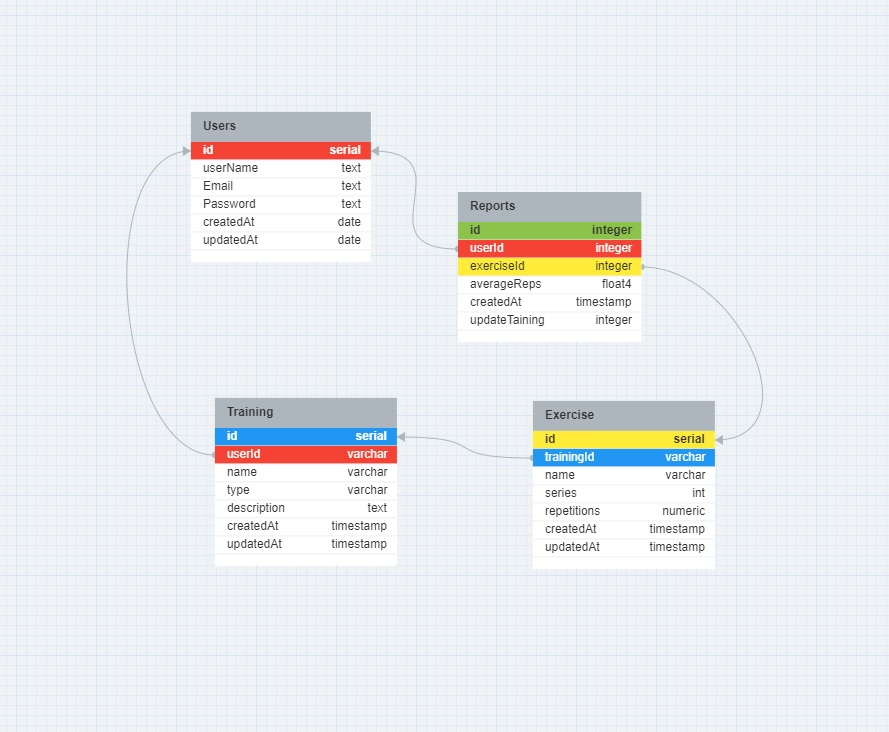

# Unchicken - Backend

O Unchicken é uma aplicação web que permite aos usuários cadastrar rotinas de treinos de calistenia, registrar seus treinos individuais e visualizar sua progressão ao longo do tempo.

## Status do Projeto

Em desenvolvimento

## Tecnologias Utilizadas

- [TypeScript](https://www.typescriptlang.org/) : Superset do JavaScript que adiciona tipagem estática.
  
- [Node.js](https://nodejs.org/) : Ambiente de execução JavaScript do lado do servidor.

- [Express](https://expressjs.com/) : Framework para construção de aplicativos web com Node.js.

- [PostgreSQL](https://www.postgresql.org/) : Sistema de gerenciamento de banco de dados relacional de código aberto.

- [Prisma](https://www.prisma.io/) : Mapeador de objeto-relacional (ORM) para Node.js e TypeScript.

- [Bcrypt](https://www.npmjs.com/package/bcrypt) : Biblioteca para hash de senhas.

- [Cors](https://www.npmjs.com/package/cors) : Middleware para habilitar o controle de acesso a recursos de uma origem diferente.

- [Dotenv](https://www.npmjs.com/package/dotenv) : Carregador de variáveis de ambiente.

- [Joi](https://joi.dev/) : Biblioteca para validação de dados.

- [Jsonwebtoken](https://www.npmjs.com/package/jsonwebtoken) : Implementação de tokens JWT para Node.js.

## Instalação e uso

1.  clone o repositório:

```bash
   git clone git@github.com:UnChicken-App/UnChicken-back-end.git
```

2. Instale as dependências:

```bash
  cd UnChicken-back-end
  npm install
```

3. Certifique-se de ter o PostgreSQL instalado e em execução.

   - Caso ainda não tenha, veja as instruções de instalação para [Linux (Ubuntu)](https://www.digitalocean.com/community/tutorials/how-to-install-postgresql-on-ubuntu-20-04-quickstart-pt) ou [WSL (Windows Subsystem for Linux)](https://learn.microsoft.com/pt-br/windows/wsl/tutorials/wsl-database#install-postgresql).

4. Configuração do banco de dados:
   - Crie um arquivo `.env` na raiz do projeto com as configurações do banco de dados. Você pode utilizar arquivo `.env.example` na raiz do projeto como referência:

```env
   POSTGRES_USERNAME=seu_usuario
   POSTGRES_PASSWORD=sua_senha
   POSTGRES_HOST=seu_host
   POSTGRES_PORT=sua_porta
   POSTGRES_DATABASE=seu_banco

   DATABASE_URL=postgresql://${POSTGRES_USERNAME}:${POSTGRES_PASSWORD}@${POSTGRES_HOST}:${POSTGRES_PORT}/${POSTGRES_DATABASE}?schema=public

   JWT_SECRET=sua_chave_secreta
```

5. Execute as migrações do banco de dados:

```bash
   npx prisma migrate dev
```

6. Execute o seguinte comando para iniciar o servidor:

```bash
  npm run dev
```

7. Para iniciar o projeto frontend, siga as instruções no repositório [Unchicken-front-end](https://github.com/UnChicken-App/UnChicken-frontend).

## Estrutura do Projeto

- `/prisma`: Responsável por gerenciar a integração do Prisma com o projeto.
  - `schema.prisma`: Define os esquemas do banco de dados Prisma,
  - `migrations/`: Para as migrações do banco de dados (PSQL).
- `/src`: Contém o código-fonte da aplicação.
  - `/config`: Configurações do projeto, incluindo o arquivo `database.ts` para as configurações do banco de dados.
  - `/controllers`: Controladores da aplicação.
  - `/errors`: Lógica relacionada ao tratamento de erros.
  - `/middlewares`: Middlewares, como autenticação e autorização.
  - `/repositories`: Lógica de acesso ao banco de dados.
  - `/routes`: Definição das rotas da API.
  - `/schemas`: Contém os esquemas de validação do projeto, utilizados para validar dados de entrada em diferentes partes da aplicação.
  - `/services`: Lógica de negócios da aplicação.
  - `app.ts`: Arquivo para configurar e inicializar o aplicativo Express.
  - `protocols.ts`: Contratos, interfaces ou tipos compartilhados.
  - `server.ts`: Arquivo para iniciar o servidor.

### Design Atual do Banco de Dados



_Observações:_ 
 - _As informações necessárias para o gerenciamento de sessão, como o vencimento do token, são armazenadas no próprio token JWT, eliminando a necessidade de criar uma tabela no PostgreSQL para sessions._
 - _O título "Design atual do Banco de Dados" indica que a imagem reflete o estado atual, mas pode ser alterada conforme necessário durante o desenvolvimento do projeto._


## Contato

Para mais informações ou dúvidas, entre em contato através do e-mail [breno_mg10@hotmail.com].
